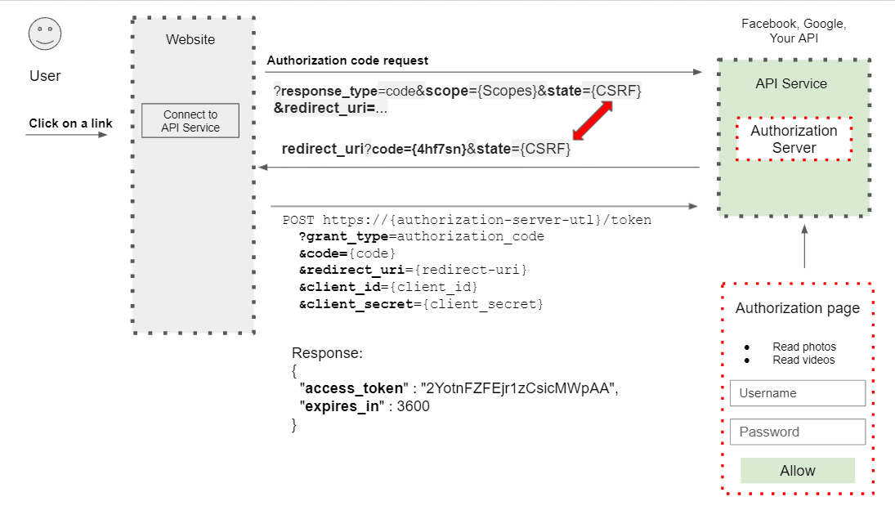
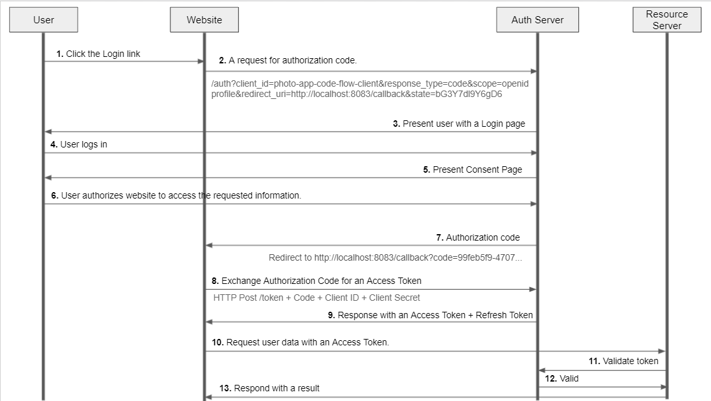

# OAuth 2 Grant Types and Authorization Flows

## ✅ Introduction
### What is a Grant Type?
`Grant type`: 애플리케이션이 Access Token 을 얻는 방법

- `Server Side Web App`: Authorization Code, Password grant
- `Server Side Script with no UI`: client credentials
- `Javascript Single Page App`: PKCE Enhanced Authorization code, implicit Flow, Password grant
- `Mobile Native App`: Authorization Code, PKCE Enhanced Authorization code, implicit Flow, Password grant
- `Device`: Device code

### Refresh Token Grant Type
`Refresh Token Grant Type`: Refresh Token 을 Access Token 과 교환하는데 사용

Refresh Token 런타임을 통해 Client 애플리케이션에서 Access Token 을 새로 고치고 확장할 수 있다. 또한 Client 애플리케이션이 추가 작업 없이 계속 유효한 Access Token 을 가질 수 있도록 한다.

## ✅ Authorization Code. Introduction.

1. 웹 사이트 방문자는 Facebook 또는 Google 계정에 연결하는 것을 허용하기로 결정한다.
2. `Click on link`: `User` 가 일부 데이터를 가져와서 내 계정연결 버튼을 클릭한다.
3. `Connect to API Service`: `Website` 가 redirect 된다.
4. `첫번째 Authorization code request`: Request Parameter 를 포함하여 Authorization Server 로 보낸다. (WebSite -> Authorization Server) 
    - `response_type`: Required. Must be "code"
    - `state`: Authorization Server 가 응답한 값과 User 가 보낸 값이 정확히 동일한지 확인.
    - `redirect_uri`: 권한 부여가 성공하고 Client 애플리케이션이 처리할 수 있도록 함.
    - `scope`: (예) read folder, read video, 권한이 부여된 후 Client 애플리케이션이 User 를 대신해 Access 할 수 있어야 하는 정보
    - `client_id`: Client 식별자이다. User 가 아니며 login 을 시도하는 사용자를 식별하지 않는다. Client 애플리케이션 식별자일 수도 있다.
5. `Authorization Page`: User 가 인증을 위해 ID와 PW를 제공해야하는 로그인 페이지, 이 로그인 페이지가 표시가 성공했다는 것은 Authorization Server 가 존재한다는 의미
6. `Authorization code request 에 대한 응답`: Authorization Server 는 수명이 짧은 Authorization code 를 생성하고 redirect_uri 에 첨부한다. (Authorization Server -> WebSite)
   - `code`: 최대 약 10분을 권장, 고유, 두번 이상 사용 불가
   - `state`: Request Parameter 와 동일함 값 포함
7. `두번째 Authorization code request`: Authorization code 를 AccessToken 으로 교환 요청을 한다. 사람들의 요청을 인증 서버로 보내 값을 인증한다.(WebSite -> Authorization Server)
8. `Response JSON`: Authorization Server 가 요청을 검사하고 모든 것이 정상이면 Access Token 을 포함한 JSON 을 보낸다. (Authorization Server -> WebSite)

1. `Click the Login link`: 사용자가 링크를 클릭하여 Website 가 통신할 수 있도록 승인
2. `A request for authorization code`: 요청을 Authorization Server 로 redirect 함
3. `Present user with a Login page`: Authorization Server 는 먼저 사용자를 인증해야 하므로 사용자에게 로그인 페이지 표시
4. `User logs in`: 사용자는 로그인 함
5. `Present Consent Page`: 로그인에 성공하면 Authorization Server 는 사용자에게 사용자를 대신하여 요청한 정보에 접근하기 위한 이 Website 가 승인되었는지 묻는 동의 페이지를 표시
6. `User authorizes website to access the requested information`: 사용자는 허용 버튼을 클릭하여 Authorization Server 에 요청된 정보를 접근할 수 있는 Website 에게 권한을 부여함을 알린다.
7. `Authorization code`: Authorization Server 가 사용자 동의를 받으면 Authorization code 를 생성한다. Authorization code는 Redirect_uri 에 첨부된다. 해당 redirect 로 redirect 된다.
8. `Exchange Authorization Code for an Access Token`: redirect 로 받은 Authorization code 를 Access Token 으로 교환해야 한다. 
Authorization Server 에게 Authorization code 와 Clinet ID, Client Secret Key 같은 자체 자격 증명을 포함해 HTTP POST 요청을 보낸다.
9. `Response with an Access Token + Refresh Token`: Authorization Server 는 요청의 유효성을 검사하고 모든 것이 정상이면 Access Token 과 Refresh Token 을 응답한다.
10. `Request user data with an Access Token`: Client 애플리케이션은 Access Token 을 가지고 있기에 사용자 데이터를 가져오도록 Resource Server 로 요청을 보낼 수 있다.
11. `Validate token`: Resource Server 가 Access Token 이 포함된 요청을 받으면 Authorization Server 로 Access Token 의 유효성 검사를 해야 한다.
12. `Valid`: Authorization Server 는 유효성 검사 결과를 Resource Server 로 보낸다.
13. `Respond with a result`: Access Token 이 유효하면 Resource Server 는 요청된 애플리케이션으로 응답을 결과와 함께 보낸다.

## ✅ Authorization Code Demo. Initial Request.
## ✅ Authorization Code Demo. Exchange code for Access token.
## ✅ PKCE-enhanced Authorization Code.
## ✅ Generating PKCE Code Verifier.
## ✅ Generating PKCE Code Challenge.
## ✅ PKCE Demo. Requesting Authorization Code.
## ✅ PKCE Demo. Exchanging Code for Access Token.
## ✅ Client Credentials.
## ✅ Client Credentials Grant Type Demo.
## ✅ The Password Credentials Flow.
## ✅ The Password Credentials Flow: Demo.
